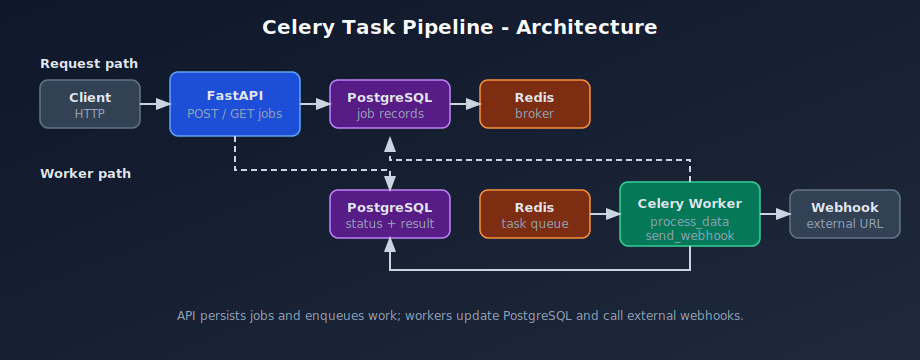
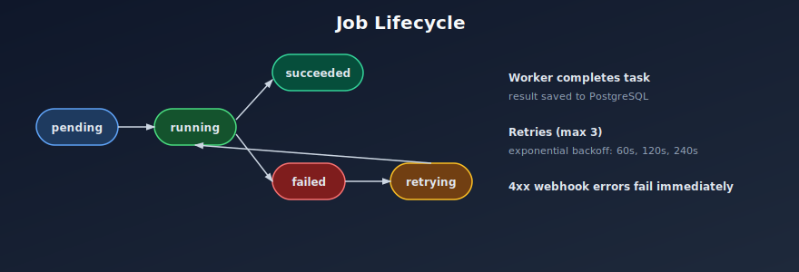
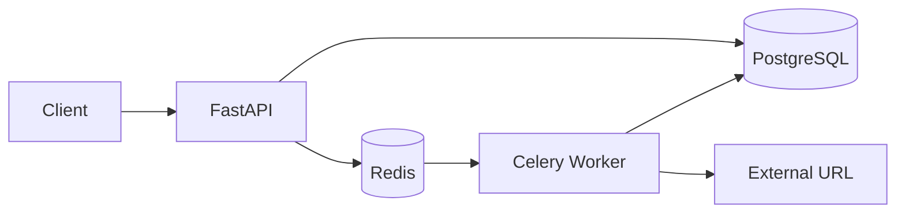

# Celery Task Pipeline API

[](https://github.com/SparkScribe/celery-task-pipeline/actions/workflows/ci.yml)
[](https://www.python.org/downloads/)
[](LICENSE)

Production-style **background job API** built with FastAPI, Celery, Redis, and PostgreSQL. Clients submit work over HTTP, workers process tasks asynchronously, and job status is stored for polling.

Built by [Ankit Vaghani](https://www.linkedin.com/in/ankit-vaghani/) · [SparkScribe Technologies](https://sparkscribetech.com)

---

## About

This project demonstrates a common async job pattern: the API accepts requests quickly, persists job metadata, and delegates execution to horizontally scalable workers. It is intended as a reference for queue-based designs (exports, webhooks, data transforms) without coupling to a specific product domain.

**Stack:** FastAPI · Celery 5 · Redis 7 · PostgreSQL 15 · SQLAlchemy · httpx

---

## Features

- Submit jobs via REST (`process_data`, `send_webhook`)
- Poll job status or list jobs with filters
- Celery workers in a separate Docker service
- Retries with exponential backoff (max 3)
- `Idempotency-Key` header to prevent duplicate submissions
- Health check for API, Redis, and PostgreSQL

---

## Architecture





<details>
<summary>Mermaid source</summary>



</details>

| Component | Role |
|---|---|
| FastAPI | Job submission and status API |
| PostgreSQL | Durable job records |
| Redis | Celery broker and result backend |
| Celery worker | Runs `process_data` and `send_webhook` tasks |

---

## Quick start

**Requirements:** Docker and Docker Compose

```bash
git clone https://github.com/SparkScribe/celery-task-pipeline.git
cd celery-task-pipeline
cp .env.example .env
docker compose up --build
```

| Endpoint | URL |
|---|---|
| API | http://localhost:8000 |
| Docs | http://localhost:8000/docs |
| Health | http://localhost:8000/health |

Run the smoke test:

```bash
bash scripts/e2e-smoke.sh
```

Scale workers:

```bash
docker compose up --scale worker=3
```

Optional Flower monitoring:

```bash
docker compose --profile monitoring up
# UI: http://localhost:5555
```

---

## API overview

| Method | Path | Description |
|---|---|---|
| `GET` | `/health` | Service health |
| `POST` | `/api/v1/jobs` | Create a job |
| `GET` | `/api/v1/jobs` | List jobs (`status`, `task_type`, `page`, `page_size`) |
| `GET` | `/api/v1/jobs/{id}` | Job details |

### Create a job

```bash
curl -X POST http://localhost:8000/api/v1/jobs \
  -H "Content-Type: application/json" \
  -d '{
    "task_type": "process_data",
    "payload": {"input_text": "hello", "delay_seconds": 1}
  }'
```

### Check status

```bash
curl http://localhost:8000/api/v1/jobs/<job-id>
```

### Task types

| Type | Description | Result |
|---|---|---|
| `process_data` | Sleep (max 30s), uppercase text, word count | `output_text`, `word_count` |
| `send_webhook` | POST JSON to URL (10s timeout) | `http_status` |

Webhook retry policy: retry on 5xx and network errors; fail immediately on 4xx.

---

## Idempotency

Send an `Idempotency-Key` header (max 64 chars) on job creation:

- **First request** → `201 Created`, job enqueued
- **Duplicate key** → `200 OK`, same job returned, not re-enqueued

```bash
curl -X POST http://localhost:8000/api/v1/jobs \
  -H "Content-Type: application/json" \
  -H "Idempotency-Key: my-unique-key" \
  -d '{"task_type":"process_data","payload":{"input_text":"hello"}}'
```

Use a stable key per logical operation and reuse it when retrying after timeouts.

---

## Configuration

See [`.env.example`](.env.example). Key variables:

| Variable | Description |
|---|---|
| `DATABASE_URL` | PostgreSQL URL (async for API) |
| `CELERY_BROKER_URL` | Redis broker URL |
| `CELERY_RESULT_BACKEND` | Redis result backend |
| `CELERY_TASK_MAX_RETRIES` | Max retries per task (default `3`) |
| `WEBHOOK_TIMEOUT_SECONDS` | Webhook HTTP timeout (default `10`) |

---

## Development

```bash
python3.11 -m venv .venv && source .venv/bin/activate
pip install -e ".[dev]"

docker compose up db redis
uvicorn app.main:app --reload

# separate terminal
celery -A app.core.celery_app worker --loglevel=info
```

### Tests

```bash
# Unit tests
pytest tests -m "not integration" -v

# Integration (stack running)
docker compose up -d
pytest tests -m integration -v
```

CI runs linting, unit tests (80%+ coverage), and a Docker end-to-end smoke test.

---

## Project structure

```
app/
  api/v1/       HTTP routes
  core/         config, Celery, Redis
  models/       SQLAlchemy models
  services/     business logic
  tasks/        Celery tasks
docs/images/    architecture diagrams
scripts/        e2e-smoke.sh
tests/          test suite
```

---

## Author

<table>
  <tr>
    <td><strong>Name</strong></td>
    <td>Ankit Vaghani</td>
  </tr>
  <tr>
    <td><strong>Organization</strong></td>
    <td><a href="https://sparkscribetech.com">SparkScribe Technologies</a></td>
  </tr>
  <tr>
    <td><strong>GitHub</strong></td>
    <td><a href="https://github.com/vaghaniankit">@vaghaniankit</a> · <a href="https://github.com/SparkScribe">@SparkScribe</a></td>
  </tr>
  <tr>
    <td><strong>LinkedIn</strong></td>
    <td><a href="https://www.linkedin.com/in/ankit-vaghani/">linkedin.com/in/ankit-vaghani</a></td>
  </tr>
  <tr>
    <td><strong>Website</strong></td>
    <td><a href="https://sparkscribetech.com">sparkscribetech.com</a></td>
  </tr>
</table>

Built and maintained by **Ankit Vaghani** · [SparkScribe Technologies](https://sparkscribetech.com)

---

## License

MIT — see [LICENSE](LICENSE). Copyright (c) 2026 Ankit Vaghani, SparkScribe Technologies.
